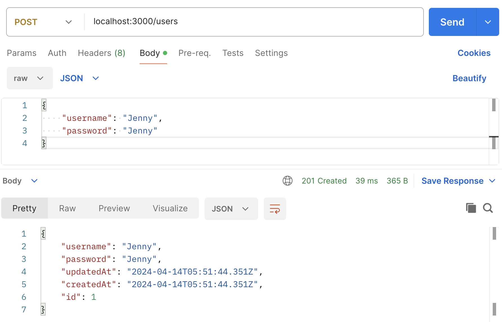

# Scooter Renting System

- nestjs
- mariadb

## Development

```bash
npm i
npm run start:dev
npm run start:prod
npm run test
```

### Database

`app.module.ts`

```
TypeOrmModule.forRoot({
      type: 'mysql',
      host: 'localhost',
      port: 3306,
      username: 'scooter',
      password: 'scooter',
      database: 'scooter',
      // entities: [],
      autoLoadEntities: true,
      synchronize: true,
    }),
```

Use docker image as mysql database.

```
docker run -d --name mysql -p 30011:3306 -e MYSQL_ROOT_PASSWORD=root mysql

docker exec -it mysql mysql -uroot -proot
```

```
create user 'scooter'@'172.17.0.1';

grant all privileges on scooter.* to 'scooter'@'172.17.0.1';
```

## API

* Create User



#### User

<details>
 <summary><code>GET</code> <code><b>/users</b></code> <code>(gets all users)</code></summary>

##### Parameters

> None

##### Responses

> | http code | content-type       | response                                                                                                                 |
> | --------- | ------------------ | ------------------------------------------------------------------------------------------------------------------------ |
> | `200`     | `application/json` | [] or [{ "id": 14,"username": "jenny", "password": "jenny", "updatedAt": null,"createdAt": "2023-05-27T10:53:15.000Z" }] |

##### Example cURL

> ```javascript
>  curl -X GET -H "Content-Type: application/json" http://localhost:3000/users
> ```

</details>

<details>
 <summary><code>GET</code> <code><b>/users/{id}</b></code> <code>(gets user by its id)</code></summary>

##### Parameters

> | name | type     | data type | description                  |
> | ---- | -------- | --------- | ---------------------------- |
> | `id` | required | number    | The specific user numeric id |

##### Responses

> | http code | content-type       | response                                                                                                         |
> | --------- | ------------------ | ---------------------------------------------------------------------------------------------------------------- |
> | `200`     | `application/json` | `{"id": 14,"username": "jenny","password": "jenny", "updatedAt": null, "createdAt": "2023-05-27T10:53:15.000Z"}` |
> | `400`     | `application/json` | `{ "statusCode": 400,"message": "id '1' not found","error": "Bad Request"}`                                      |

##### Example cURL

> ```javascript
>  curl -X GET -H "Content-Type: application/json" http://localhost:3000/users/10
> ```

</details>

<details>
  <summary><code>GET</code> <code><b>/users/{id}/usage</b></code> <code>(Get renting record of a specific user)</code></summary>

##### Parameters

> | name | type     | data type | description            |
> | ---- | -------- | --------- | ---------------------- |
> | `id` | required | number    | The specific user's id |

##### Responses

> | http code | content-type       | response                                                                                                                         |
> | --------- | ------------------ | -------------------------------------------------------------------------------------------------------------------------------- |
> | `200`     | `application/json` | array of records `{"start": "2023-05-31T12:13:23.000Z", "end": "2023-05-31T15:13:47.000Z", "scooter": 11, "duration": 0.1804 },` |
> | `400`     | `application/json` | `{ "statusCode": 400,"message": "id '1' not found","error": "Bad Request"}`                                                      |

##### Example cURL

> ```javascript
>  curl -X GET -H "Content-Type: application/json" http://localhost:8889/users/10
> ```

</details>

---
